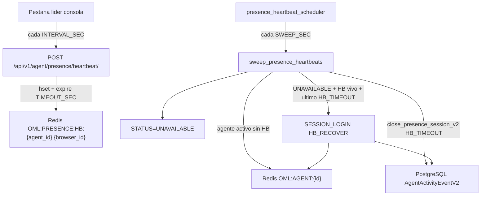
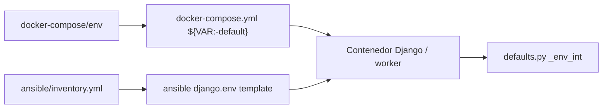

# Sesión de agente: presencia y heartbeat

Este documento describe el módulo de **presencia de sesión** del agente: cómo la consola mantiene viva su sesión mediante heartbeats, qué claves Redis intervienen, el worker `presence-heartbeat-scheduler` y las variables de entorno configurables.

Para el flujo completo de la consola (toolbar, modelos V2, InteractionsSummary), ver también [prescence.md](prescence.md).

---

## 1. Conceptos

El sistema distingue dos capas:

| Capa | Almacenamiento | Qué representa |
|------|----------------|----------------|
| **Presencia V2** | PostgreSQL (`AgentActivityEventV2`) | Historial de sesión: `SESSION_LOGIN` / `SESSION_LOGOUT` y cambios de estado. Es la fuente de verdad para saber si la sesión de presencia está abierta o cerrada. |
| **Estado operativo** | Redis (`OML:AGENT:{id}`) | Estado telefónico en tiempo real: `READY`, `PAUSE-*`, `OFFLINE`, `UNAVAILABLE`, etc. |
| **Heartbeat** | Redis (`OML:PRESENCE:HB:*`) | Señal periódica del navegador que indica que la consola sigue activa. Si deja de llegar, el scheduler cierra la presencia. |

**Presencia abierta (V2):** el último evento del agente no es `SESSION_LOGOUT`.  
**Presencia cerrada (V2):** el último evento es `SESSION_LOGOUT` (incluye cierres sintéticos por timeout o sesión expirada).

La consola consulta V2 al cargar: si la presencia está cerrada, redirige al login (`should_redirect_by_closed_presence`).

---

## 2. Flujo de sesión (login / logout)

### 2.1 Login HTTP

1. El agente inicia sesión en Django.
2. `AgentPresenceManager.login()` persiste `SESSION_LOGIN` en V2 (con idempotencia: cooldown y estado Redis).
3. En la consola, el agente puede "Conectar" a Asterisk → `OML:AGENT:{id}` pasa a `STATUS=READY`.

### 2.2 Logout explícito

1. `AgentLogoutView` ejecuta `logout_agent()` → Redis `STATUS=OFFLINE`.
2. Luego `AgentPresenceManager.logout()` → `SESSION_LOGOUT` en V2.
3. El frontend detiene el heartbeat (`deactivatePresenceHeartbeat()`).

### 2.3 Cierre por sesión expirada

Al hacer login, si la sesión Django anterior expiró y V2 sigue abierta, `fix_previous_open_session_logs()` inserta un `SESSION_LOGOUT` sintético con `source='SESS_EXPIRED'`.

---

## 3. Flujo de heartbeat

### 3.1 Frontend (consola del agente)

Componentes principales:

| Componente | Archivo |
|------------|---------|
| Inicialización | `ominicontacto_app/static/ominicontacto/JS/agente/main.js` |
| Envío periódico | `PresenceHeartbeatSender` en `phoneJsController.js` |
| API HTTP | `omlAPI.sendPresenceHeartbeat()` → `POST /api/v1/agent/presence/heartbeat/` |

Al cargar la consola:

1. Se crea `PresenceHeartbeatSender` con `PRESENCE_HEARTBEAT_INTERVAL_SEC` y el TTL de líder (45 s, hardcodeado en la vista de consola).
2. La FSM del agente activa el sender al arrancar.
3. **Solo la pestaña líder** envía heartbeats (elección vía `localStorage` + `BroadcastChannel` entre pestañas del mismo browser).
4. Cada `INTERVAL_SEC` segundos la pestaña líder hace POST con:

```json
{
  "browser_id": "browser-...",
  "tab_id": "tab-...",
  "leader": true,
  "ui_state": "Ready",
  "sent_at_ms": 1716998400000
}
```

5. Al logout o `beforeunload`, se llama `deactivate()` y dejan de enviarse heartbeats.

### 3.2 Backend (API)

`AgentPresenceHeartbeatView` (`api_app/views/agente.py`):

1. Valida `browser_id` y `tab_id`.
2. Escribe un hash en Redis `OML:PRESENCE:HB:{agent_id}:{browser_id}`.
3. Renueva el TTL de esa clave a `PRESENCE_HEARTBEAT_TIMEOUT_SEC`.

La elección de pestaña líder ocurre solo en el browser (`localStorage` + `BroadcastChannel`); el backend no persiste claves de líder en Redis.

Respuesta:

```json
{
  "status": "OK",
  "server_ts_ms": 1716998400123,
  "next_heartbeat_sec": 15
}
```

### 3.3 Scheduler (detección de timeout y recuperación)

El comando `presence_heartbeat_scheduler` corre como worker de fondo y ejecuta un **barrido unificado** cada `PRESENCE_HEARTBEAT_SWEEP_SEC` segundos (`sweep_presence_heartbeats`).

Por cada agente en la unión de agentes con clave `OML:AGENT:*` y agentes con heartbeat vivo:

#### Recuperación (tiene HB + `STATUS=UNAVAILABLE`)

1. Si el último evento V2 es `SESSION_LOGOUT` con `source='HB_TIMEOUT'`:
   1. Inserta `SESSION_LOGIN` sintético en V2 (`source='HB_RECOVER'`, `metadata.status_restored` con el `status_before` del logout).
   2. Restaura `OML:AGENT:{id}` al `status_before` guardado (`READY`, `PAUSE-*`, `RINGING`; fallback `READY`). Para pausas, usa `metadata.pause_id` si está disponible.

#### Cierre por timeout (sin HB + `STATUS` activo)

1. Si la presencia V2 está **cerrada** y el último evento es `HB_TIMEOUT` reciente (dentro de `LOGOUT_RECENT_SEC`) → reconcilia Redis a `UNAVAILABLE` si hace falta (sin reinsertar en V2).
2. Si la presencia V2 está **abierta**:
   1. Inserta `SESSION_LOGOUT` sintético en V2 (`source='HB_TIMEOUT'`, `metadata.reason='timeout'`, `metadata.status_before` y opcionalmente `metadata.pause_id`).
   2. Setea `OML:AGENT:{id}` → `STATUS=UNAVAILABLE`.

La idempotencia de V2 se basa en el último evento (`get_presence_session_tail`); no hay clave guardia Redis adicional.

No hay ventana temporal adicional para recuperación: mientras el último evento siga siendo `HB_TIMEOUT` y el HB esté vivo, el scheduler recupera la sesión (el propio HB implica sesión Django válida).



### 3.4 ¿Cuándo se cumple el timeout?

`PRESENCE_HEARTBEAT_TIMEOUT_SEC` es el **TTL de la clave Redis del heartbeat**. Si el servidor no recibe un POST exitoso en ese lapso, la clave expira y el scheduler considera al agente sin presencia viva.

Con los defaults (`INTERVAL=15`, `TIMEOUT=60`): mientras la pestaña líder envíe heartbeats cada 15 s, la clave se renueva y **no debería dispararse el timeout**. Puede ocurrir si:

- Se cierra la pestaña o el browser sin logout.
- Hay corte de red o fallos repetidos del POST.
- La pestaña queda en background y el browser throttlea los `setInterval`.
- La máquina entra en sleep/hibernación.
- La sesión Django expira (heartbeat devuelve 403).

---

## 4. Claves Redis

| Clave | Tipo | TTL | Escrita por | Descripción |
|-------|------|-----|-------------|-------------|
| `OML:AGENT:{agent_id}` | Hash | — | `AgentActivityAmiManager` | Estado operativo del agente. Campos: `STATUS`, `TIMESTAMP`, `PAUSE_ID`, `CALLID`, `NODE_ID`, etc. |
| `OML:PRESENCE_LOG_DEBOUNCE:{agent_id}` | Hash | — | `AgentPresenceManager` | Debounce login/logout. Campos: `last_event_type`, `last_event_ts` (ms). Evita flapping `LOGIN→LOGOUT→LOGIN` dentro de `PRESENCE_LOG_RECONNECT_COOLDOWN_MS`. |
| `OML:PRESENCE:HB:{agent_id}:{browser_id}` | Hash | `PRESENCE_HEARTBEAT_TIMEOUT_SEC` | `AgentPresenceHeartbeatView` | Heartbeat de presencia. Campos: `agent_id`, `browser_id`, `tab_id`, `ui_state`, `sent_at_ms`, `server_ts_ms`. |

**Estados considerados "inactivos" por el scheduler** (no se evalúan para timeout): `''`, `OFFLINE`, `UNAVAILABLE`, `DISABLED`.

**Almacenamiento local del browser** (no Redis; solo frontend):

| Clave | Storage | Uso |
|-------|---------|-----|
| `OML:PRESENCE:BROWSER_ID` | `localStorage` | Identificador del browser (persiste entre pestañas). |
| `OML:PRESENCE:TAB_ID` | `sessionStorage` | Identificador de la pestaña. |
| `OML:PRESENCE:LEADER:{agent_id}:{browser_id}` | `localStorage` | Claim de pestaña líder con `expires_at_ms`. |

---

## 5. Despliegue: worker `presence-heartbeat-scheduler`

En Docker Compose (dev, test y prod) el scheduler se define como worker Django:

```yaml
presence-heartbeat-scheduler:
  <<: *django-worker-common
  command: python manage.py presence_heartbeat_scheduler
```

Referencia: `docker-compose/test-env/docker-compose.yml` (y equivalentes en `dev-env/` y `prod-env/`).

### Características del servicio

- Hereda el anchor `django-worker-common`: imagen Django, dependencias de PostgreSQL y Redis, variables de entorno del bloque `django-common`.
- Ejecuta el management command `presence_heartbeat_scheduler` de forma continua (proceso long-running con APScheduler).
- Usa `BackgroundScheduler` con un solo hilo (`ThreadPoolExecutor(1)`), `max_instances=1` y `coalesce=True` para evitar barridos solapados.
- Maneja señales `SIGINT`/`SIGTERM` para shutdown limpio.

### Requisitos operativos

- **Redis** debe estar accesible (lectura/escritura de claves `OML:*`).
- **PostgreSQL** debe estar accesible (escritura en `AgentActivityEventV2` al cerrar presencia).
- El servicio debe tener **supervisión y auto-restart** (equivalente a los demás workers críticos: `supervision-events-listener`, schedulers de reportes, etc.).

---

## 6. Variables de entorno

Todas se leen en `ominicontacto/settings/defaults.py` mediante `_env_int(name, default)`: si la envar no existe, está vacía o no es un entero válido, se usa el default.

| Variable de entorno | Default | Dónde se usa |
|---------------------|---------|--------------|
| `PRESENCE_LOG_RECONNECT_COOLDOWN_MS` | `1500` | `AgentPresenceManager`: ventana en ms para tratar `LOGOUT→LOGIN` como reconexión (no duplicar `SESSION_LOGIN`). |
| `PRESENCE_HEARTBEAT_INTERVAL_SEC` | `15` | Frontend: intervalo entre POSTs de heartbeat. API: valor de `next_heartbeat_sec` en la respuesta. |
| `PRESENCE_HEARTBEAT_TIMEOUT_SEC` | `60` | API: TTL de la clave Redis `OML:PRESENCE:HB:*`. Scheduler: metadata del logout sintético. |
| `PRESENCE_HEARTBEAT_SWEEP_SEC` | `15` | Scheduler: intervalo del barrido APScheduler. |
| `PRESENCE_HEARTBEAT_LOGOUT_RECENT_SEC` | `90` | Scheduler: ventana para detectar logout sintético reciente y reconciliar Redis sin reinsertar en V2. |

### Cadena de configuración



| Capa | Archivo |
|------|---------|
| Defaults Django | `ominicontacto/settings/defaults.py` |
| Plantilla env compartida | `docker-compose/env` |
| Docker Compose | `docker-compose/{dev,test,prod}-env/docker-compose.yml` (bloque `django-common`) |
| Ansible inventory | `ansible/inventory.yml` |
| Ansible template | `ansible/roles/omlapp/templates/django.env` |

### Relación recomendada entre parámetros

```
PRESENCE_HEARTBEAT_TIMEOUT_SEC  ≥  3–4 × PRESENCE_HEARTBEAT_INTERVAL_SEC
PRESENCE_HEARTBEAT_LOGOUT_RECENT_SEC  ≥  PRESENCE_HEARTBEAT_TIMEOUT_SEC
```

Con los defaults (15 / 60 / 90): el agente puede fallar ~4 heartbeats consecutivos antes de que expire la clave; el scheduler detecta la ausencia en el siguiente barrido (≤ 15 s después).

---

## 7. Eventos sintéticos V2

| `source` | Disparador | `metadata.reason` típico |
|----------|------------|--------------------------|
| `HB_TIMEOUT` | `presence_heartbeat_scheduler` (fase cierre) | `timeout` |
| `HB_RECOVER` | `presence_heartbeat_scheduler` (fase recuperación) | `heartbeat_recovered` |
| `SESS_EXPIRED` | `fix_previous_open_session_logs` al login | `session_expired` |

Tras un `HB_TIMEOUT`, si el heartbeat vuelve antes de que el agente recargue la consola, el scheduler inserta `HB_RECOVER` y reabre V2 automáticamente. Si no hay recuperación, la consola redirige al login en la próxima carga porque V2 tiene presencia cerrada.

---

## 8. Referencias de archivos

| Componente | Archivo |
|------------|---------|
| Servicio de presencia | `ominicontacto_app/services/agent/presence.py` |
| API heartbeat | `api_app/views/agente.py` (`AgentPresenceHeartbeatView`) |
| URL API | `api_app/urls.py` → `api/v1/agent/presence/heartbeat/` |
| Scheduler | `ominicontacto_app/management/commands/presence_heartbeat_scheduler.py` |
| Vista consola (contexto heartbeat) | `ominicontacto_app/views/base.py` (`ConsolaAgenteView`) |
| JS heartbeat | `ominicontacto_app/static/ominicontacto/JS/agente/phoneJsController.js` |
| Escritura V2 / sources sintéticos | `reportes_app/agent_activity_dual_write.py` |
| Settings | `ominicontacto/settings/defaults.py` |
| Docker Compose worker | `docker-compose/test-env/docker-compose.yml` (servicio `presence-heartbeat-scheduler`) |
| Health checks / eventos sintéticos | `docs/agent_events_health_checks.md` |
