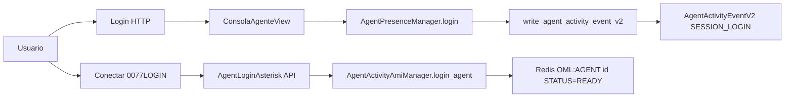
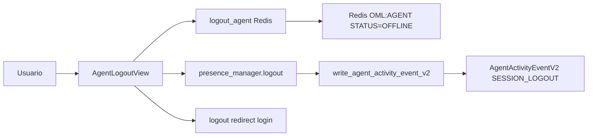
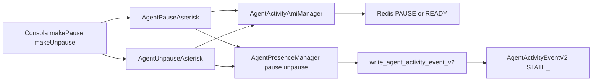
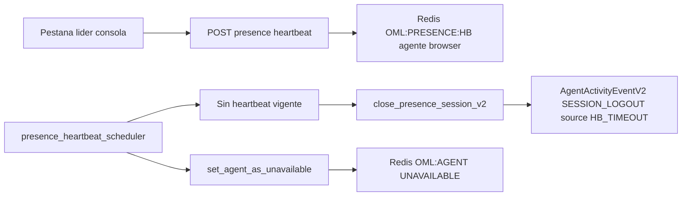
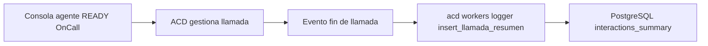

# Presencia: consola de agente, modelos y backend (Redis / PostgreSQL)

Este documento describe las relaciones entre la **consola de agente** ("console"), los modelos **InteractionsSummary** y **AgentActivityEventV2**, la clave Redis **OML:AGENT:{id_agent}**, la vista de agente, la toolbar y el backend (Redis y PostgreSQL).

---

## 1. Introducción

La **consola de agente** es la interfaz que usa un agente para:

- Iniciar y cerrar sesión (login/logout HTTP y "Conectar"/"Desconectar" a Asterisk).
- Gestionar su estado (pausa, despausa).
- Recibir y realizar llamadas (webphone).
- Mantener presencia viva mediante heartbeats.

En el flujo intervienen:

- **Frontend**: vista Django, template HTML, JavaScript (FSM del agente, API calls).
- **Backend Django**: vistas, APIs REST, servicios de presencia y de estado en Redis.
- **Redis**: estado operativo del agente (`OML:AGENT:{id}`) y claves de presencia/heartbeat.
- **PostgreSQL**: historial de presencia/actividad en **AgentActivityEventV2** (escritura única para eventos nuevos). El modelo `ActividadAgenteLog` queda como legacy de solo lectura para datos históricos. Resumen de interacciones en `interactions_summary` (modelo `InteractionsSummary`).

---

## 2. Vista de agente y toolbar

### 2.1 Vista

- **Clase**: `ConsolaAgenteView`
- **Archivo**: `ominicontacto_app/views/base.py`
- **Template**: `ominicontacto_app/templates/agente/base_agente.html`
- **URL name**: `consola_de_agente` (ruta típica `/consola/`).

En `dispatch` se valida que el usuario sea agente, que no esté inactivo y que la presencia no esté cerrada en V2 (`should_redirect_by_closed_presence`). Si la presencia está cerrada (por ejemplo por timeout de heartbeat), se redirige al login. Se usa `AgentPresenceManager` para estas comprobaciones y para `enforce_login`.

En `get_context_data` se inyectan, entre otros:

- `presence_heartbeat_interval_sec`, `presence_heartbeat_timeout_sec`, `presence_heartbeat_leader_lock_ttl_sec`
- `pausas`, `agente_profile`, `sip_usuario`, `sip_password`
- `campanas_preview_activas`, `registros` (histórico de llamadas del día), etc.

### 2.2 Template y toolbar

El template `agente/base_agente.html` incluye:

- Inputs ocultos con configuración del agente y del heartbeat (por ejemplo `#presence_heartbeat_interval_sec`, `#presence_heartbeat_timeout_sec`, `#presence_heartbeat_leader_lock_ttl_sec`, `#idagt`, `#sipExt`, `#sipSec`, etc.).
- La **toolbar del agente** dentro de `container-toolbar` / `#bottomBar`: iconos para Webphone, SMS, Whatsapp, Social chat, Email. Cada uno da acceso a la funcionalidad correspondiente desde la consola.

### 2.3 JavaScript y llamadas al backend

- **main.js** (`ominicontacto_app/static/ominicontacto/JS/agente/main.js`): Inicializa `PresenceHeartbeatSender` con el intervalo y TTL de líder, y el `PhoneJSController` (FSM + webphone). Desactiva el heartbeat al cerrar/antes de salir.
- **phoneJsController.js**: Máquina de estados del agente (Initial, End, Ready, Paused, OnCall, etc.). Activa el heartbeat cuando la FSM arranca y registra un provider de estado (`phone_fsm.state`) para enviar como `ui_state` en cada heartbeat. Desactiva el heartbeat en estado End.
- **omlAPI.js**: Métodos que disparan las llamadas HTTP/API:
  - `sendPresenceHeartbeat(payload, callback_ok, callback_error)` → POST al endpoint de presence heartbeat.
  - `asteriskLogin(callback_ok, callback_error)` → POST login a Asterisk (estado READY en Redis).
  - `makePause(pause_id, ...)` → POST pausa.
  - `makeUnpause(pause_id, ...)` → POST despausa.

El logout desde la consola usa la vista `AgentLogoutView` (no un método de `omlAPI.js`), que primero pone al agente en Redis como OFFLINE y luego ejecuta `presence_manager.logout()` y `logout(request)`.

---

## 3. Redis `OML:AGENT:{id_agent}`

### 3.1 Formato y definición

- **Clave**: `OML:AGENT:{id_agent}` donde `id_agent` es el ID del perfil del agente.
- **Tipo**: Hash.
- **Definición en código**: `AgenteFamily.KEY_PREFIX = "OML:AGENT:{0}"` en `ominicontacto_app/services/asterisk/redis_database.py`.

### 3.2 Campos del hash

| Campo         | Descripción                                                                 |
|---------------|-----------------------------------------------------------------------------|
| STATUS        | Estado operativo: READY, OFFLINE, RINGING, PAUSE-{nombre}, UNAVAILABLE, DISABLED, etc. |
| TIMESTAMP     | Marca de tiempo (segundos) de la última actualización.                      |
| PAUSE_ID      | Presente cuando STATUS es una pausa (ej. PAUSE-ACW, PAUSE-Supervision).     |
| CAMPAIGN      | Vacío en READY o pausa no-ACW; puede rellenarse en llamada.                  |
| CONTACT_NUMBER| Idem.                                                                      |
| CALLID        | Identificador de llamada cuando el agente está en llamada (ej. desde ACD). |
| NODE_ID       | Nodo ACD cuando aplica.                                                     |

### 3.3 Quién escribe (desde la consola / flujo agente)

Todas las escrituras pasan por **AgentActivityAmiManager** (`ominicontacto_app/services/asterisk/agent_activity.py`):

- **login_agent** → STATUS=READY (disparado por API `AgentLoginAsterisk` cuando el agente "Conecta" / 0077LOGIN).
- **logout_agent** → STATUS=OFFLINE (disparado por `AgentLogoutView`).
- **pause_agent** → STATUS=PAUSE-{nombre}, PAUSE_ID (disparado por `AgentPauseAsterisk`).
- **unpause_agent** → STATUS=READY (disparado por `AgentUnpauseAsterisk`).
- **set_agent_as_unavailable** → STATUS=UNAVAILABLE (por ejemplo desde el scheduler de heartbeat cuando hay timeout).

El ACD u otros componentes pueden actualizar además CALLID, NODE_ID, etc., cuando el agente está en llamada.

### 3.4 Quién lee

- **Presencia**: `AgentPresenceManager._should_persist_session_event` lee STATUS para decidir idempotencia de SESSION_LOGIN (evitar duplicar login si ya está READY o en pausa).
- **Scheduler de heartbeat**: Escanea `OML:AGENT:*` para detectar agentes "activos" sin heartbeat y cerrar presencia + UNAVAILABLE.
- **Vistas de supervisión, transfer y reportes**: Leen el hash para estado del agente, CALLID, NODE_ID (ej. `api_app/views/agente.py`, `api_app/views/transfer.py`, `supervision_app/views.py`, `dashboard_camp_app/views.py`).

---

## 4. Modelo AgentActivityEventV2

### 4.1 Definición

- **Modelo**: `AgentActivityEventV2` en `reportes_app/models.py` (tabla `reportes_app_agentactivityeventv2`).
- **Propósito**: Historial de eventos de actividad/presencia del agente (login, logout, cambios de estado).

### 4.2 Tipos de evento (EventType)

| EventType     | Descripción                          |
|---------------|--------------------------------------|
| SESSION_LOGIN | Sesión de presencia abierta.        |
| SESSION_LOGOUT| Sesión de presencia cerrada.        |
| STATE_READY   | Agente listo (despausa).             |
| STATE_PAUSED  | Agente en pausa (con pause o aux_code). |
| STATE_ACW     | After Call Work (pausa ACW).         |
| STATE_ON_HOLD | Llamada en hold.                     |
| STATE_OFF_HOLD| Llamada saliendo de hold.            |

Campos relevantes: `agente_id`, `ts`, `event_type`, `pause` (FK opcional), `aux_code`, `source` (para eventos sintéticos), `metadata`.

### 4.3 Quién escribe

- **Sesión / pausa / despausa**: `AgentPresenceManager` (login, logout, pause, unpause) llama a `write_agent_activity_event_v2` en `reportes_app/agent_activity_dual_write.py`, que escribe **solo** en AgentActivityEventV2. Mapping: SESSION_LOGIN→SESSION_LOGIN, SESSION_LOGOUT→SESSION_LOGOUT, PAUSEALL (pausa_id '0')→STATE_ACW, PAUSEALL (otra)→STATE_PAUSED, UNPAUSEALL→STATE_READY.
- **Eventos sintéticos**: `write_agent_activity_event_v2_synthetic` para cierres de presencia (timeout de heartbeat, sesión expirada), con `source` (ej. HB_TIMEOUT, SESS_EXPIRED).
- **Hold/unhold**: `write_hold_activity_event_v2` desde vistas de hold (ApiEventoHold, transfer).

### 4.4 Cómo se dispara desde la consola

- **Login HTTP**: En `views/base.py`, tras login exitoso de agente se llama `presence_manager.login(agente_profile)` → `write_agent_activity_event_v2` → AgentActivityEventV2 (SESSION_LOGIN).
- **Logout**: `AgentLogoutView` en `api_app/views/agente.py` llama a `logout_agent` (Redis OFFLINE) y luego `presence_manager.logout(agente_profile)` → `write_agent_activity_event_v2` → AgentActivityEventV2 (SESSION_LOGOUT).
- **Pausa / Despausa**: `AgentPauseAsterisk` / `AgentUnpauseAsterisk` llaman a `AgentActivityAmiManager` (Redis) y a `AgentPresenceManager.pause` / `unpause` → `write_agent_activity_event_v2` → AgentActivityEventV2 (STATE_PAUSED/STATE_ACW o STATE_READY).
- **Timeout de heartbeat**: El comando `presence_heartbeat_scheduler` detecta agentes sin heartbeat; para ellos llama a `presence_manager.close_presence_session_v2(...)` con source HB_TIMEOUT → evento sintético SESSION_LOGOUT en V2, y luego `set_agent_as_unavailable` en Redis.

La consola usa la presencia V2 para decidir si redirigir al login: `should_redirect_by_closed_presence(agente_id)` (último evento SESSION_LOGOUT ⇒ presencia cerrada).

---

## 5. Modelo InteractionsSummary

### 5.1 Qué representa

- **Modelo**: `InteractionsSummary` en `reportes_app/models.py`, tabla `interactions_summary` (managed=False, creada por migración 0012).
- **Propósito**: Resumen omnicanal de interacciones (voz y otros canales) y KPIs: una fila por interacción (por ejemplo una llamada) con `interaction_id`, `agent_id`, `campaign_id`, `channel_type`, `direction`, `initiation_method`, `status`, duraciones (`total_duration`, `agent_duration`, `wait_conn_duration`, etc.), `disposition_id`, etc.

### 5.2 Quién escribe

La **consola no escribe** en InteractionsSummary. La escritura la realiza el **ACD** (worker de logging) al procesar eventos de **fin de llamada**:

- **Archivo**: `acd/source/workers/logger.py`
- **Función**: `insert_llamada_resumen(message)` escribe o actualiza un registro en la tabla configurada (por defecto `interactions_summary`, variable `resumen_table`).

Los mensajes de cierre de llamada llegan al logger desde el pipeline del ACD; el payload incluye `callid`, `agente_id`, `campana_id`, duraciones, status, etc., y se persiste en PostgreSQL.

### 5.3 Relación indirecta con la consola

1. El agente usa la consola para hacer login HTTP y "Conectar" → Redis `OML:AGENT:{id}` queda en READY.
2. El agente recibe/realiza llamadas (estado OnCall en la FSM); el ACD gestiona esas llamadas.
3. Al finalizar la llamada, el ACD envía un evento de cierre al logger.
4. El logger escribe en `interactions_summary` una fila con ese `agent_id`, `campaign_id`, etc.

Por tanto: **consola → estado del agente en Redis → agente en llamada → ACD → evento de cierre → logger → PostgreSQL (InteractionsSummary)**. La relación es indirecta vía estado del agente y ciclo de vida de la llamada.

---

## 6. Diagramas de flujo

### 6.1 Login HTTP y "Conectar" (Redis READY)

### 6.2 Logout

### 6.3 Pausa y Despausa

### 6.4 Heartbeat y timeout

### 6.5 Llamada a InteractionsSummary

---

## 7. Otras claves Redis relacionadas con presencia

| Clave | Uso |
|-------|-----|
| `OML:AGENT:{id}` | Estado operativo del agente (STATUS, TIMESTAMP, PAUSE_ID, CALLID, NODE_ID, etc.). |
| `OML:PRESENCE_LOG_DEBOUNCE:{id}` | Debounce login/logout (last_event_type, last_event_ts en ms) para evitar flapping. |
| `OML:PRESENCE:HB:{agente_id}:{browser_id}` | Heartbeat de presencia; TTL = timeout configurado. |
| `OML:PRESENCE:HB:LEADER:{agente_id}:{browser_id}` | Pestaña líder que envía el heartbeat; TTL = leader lock. |
| `OML:PRESENCE:HB:TIMEOUT_GUARD:{agente_id}` | Guardia tras cerrar presencia por timeout; evita repetir cierre en siguientes barridos. |

---

## 8. Referencias de archivos

| Componente | Archivo |
|------------|---------|
| Vista consola | `ominicontacto_app/views/base.py` (ConsolaAgenteView) |
| Template consola / toolbar | `ominicontacto_app/templates/agente/base_agente.html` |
| JS main / heartbeat | `ominicontacto_app/static/ominicontacto/JS/agente/main.js` |
| JS FSM / controller | `ominicontacto_app/static/ominicontacto/JS/agente/phoneJsController.js` |
| JS API | `ominicontacto_app/static/ominicontacto/JS/agente/omlAPI.js` |
| Presencia | `ominicontacto_app/services/agent/presence.py` (AgentPresenceManager) |
| Estado Redis agente | `ominicontacto_app/services/asterisk/agent_activity.py` (AgentActivityAmiManager) |
| Clave Redis agente | `ominicontacto_app/services/asterisk/redis_database.py` (AgenteFamily) |
| Scheduler heartbeat | `ominicontacto_app/management/commands/presence_heartbeat_scheduler.py` |
| APIs agente (logout, pause, unpause, heartbeat, login Asterisk) | `api_app/views/agente.py` |
| Escritura V2 (sesión, pausa, hold, sintéticos) | `reportes_app/agent_activity_dual_write.py` |
| Modelos AgentActivityEventV2, InteractionsSummary | `reportes_app/models.py` |
| ACD logger (interactions_summary) | `acd/source/workers/logger.py` |
